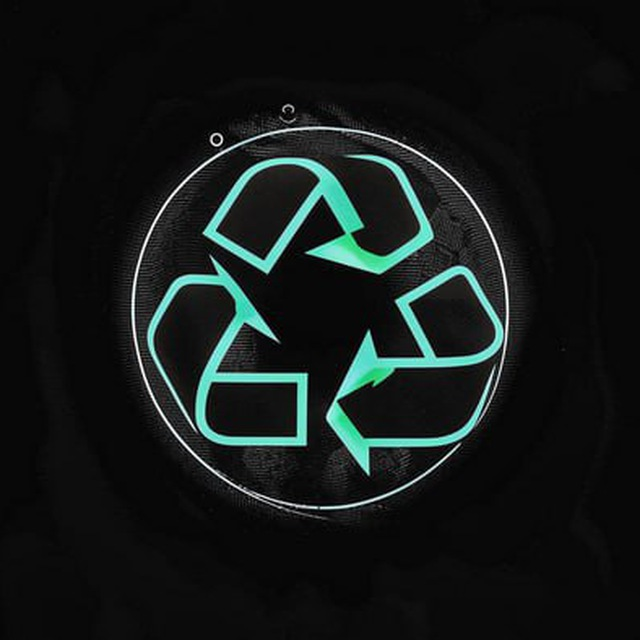

<h1 align="center">
    <code>REcycle</code>
</h1>

## Что это?

### REcycle — это телеграм-бот, который выдает вознаграждения за помощь в очистке мира от загрязнений путем простого действия, а именно сортировки мусора по категориям и прикрепления видеодоказательств, которые будут проверены модератором.

## Как найти?

### В telegram, в поиске нужно написать RecycleTgBot, либо перейти по ссылке https://t.me/RecycleTgBot.

## Какое вознаграждение?

### После того, как модератор проверит видео и оно будет соответствовать требованиям, вам будет предоставлен (не настоящий) промокод на случайно выбранный сервис. Видео можно отправлять один раз в 24 часа.

## Участники проекта

- [@windgim](https://github.com/windgim) — Программист
- [@BoLoSsEvvv](https://github.com/BoLoSsEvvv) — Программист
- [@maktraxxer444](https://github.com/maktraxxer444) — IT менеджер